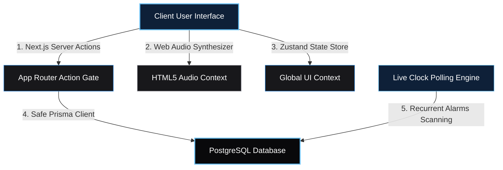

# 🧠 Infofriyends Brain OS

Welcome to **Infofriyends Brain OS** — a hyper-customized, ultra-premium dark-glassmorphic team workspace, asynchronous operating system, and collaborative startup pipeline. Built specifically for next-gen high-efficiency startup execution.

---

## 📺 Immersive Gallery & Interface Mockups

Observe the premium dark-glassmorphism, vibrant soft-blue/cyan glows, and modern layouts captured from the live application:

### 1. 📢 Dynamic Dashboard & Community Feed (`/`)
*Live company updates, team standing leaderboard, and asynchronous broadcast logs.*


### 2. 💼 Asynchronous Workspace Pipeline (`/works`)
*Visual kanban workspace showing startup assignments, custom status filters, and active card blocks.*


### 3. 💬 Asynchronous Team Chat Lounge (`/chat`)
*Realtime group channels with active typing indicators and collapsing mobile canvas drawers.*


### 4. 🔑 Standing Scorecard & Credentials (`/profile`)
*Personal scorecards rendering aggregate review counts, active ranks, and published item logs.*


### 5. 🛡️ Command Center & Member Management (`/admin`)
*Complete administrative controls: assign roles, create new members, and edit permissions safely.*


---

## 🗺️ System Architecture & Workflow State Engines

### 1. Unified Application Architecture Pipeline
Our architectural flow maps asynchronous client states, global client state stores, server actions, and relational database migrations:



### 2. Relational Database Schema Design
We run on a multi-relational **PostgreSQL schema** optimized for private scopes, cascades, and data-integrity protections:

```mermaid
erDiagram
    USER ||--o{ WORK : creates
    USER ||--o{ WORK : assigned_to
    USER ||--o{ NOTE : manages
    USER ||--o{ NOTIFICATION : receives
    WORK ||--o{ WORK_UPDATE : logs
    WORK ||--o{ WORK_REVIEW : rates
    
    USER {
        string id PK
        string username UNIQUE
        string role "ADMIN | MEMBER"
        string passwordHash
    }
    WORK {
        string id PK
        string status "IDEA | ACTIVE | BLOCKED | COMPLETED | ARCHIVED"
        string priority "LOW | MEDIUM | HIGH | URGENT"
        string assigneeId FK
    }
    NOTE {
        string id PK
        string title
        string color
        datetime reminderAt
        string userId FK
    }
    NOTIFICATION {
        string id PK
        string title
        string type "INFO | REMINDER | WARNING | BLOCKER"
        boolean isRead
        string userId FK
    }
```

---

## 💎 Breathtaking Premium Features Implemented Today

### 1. 📖 Emoji-Free Contextual Handbook (`HelpGuideModal.tsx`)
- **Interactive Guides**: Toggled via a floating `(?)` question-mark icon present on all pages. Displays detailed, contextual explanations (e.g. Workspace card pipelines, consensus voting, user onboarding).
- **Staggered Animations**: Built with Framer Motion spring dynamics and sliding active tab backlights (`layoutId="activeTabGlow"`).
- **Authorship Compliance**: Strictly signed and attributed to the **Infofriyends Technology Team** — completely free of placeholder titles.

### 2. 📂 Sliding Personal Notes Canvas Drawer (`NotesDrawer.tsx`)
- **Note Grid**: Slide-out glassmorphic panel powered by Framer Motion. Allows users to write quick thoughts, task lists, or markdown snippets.
- **Color Label Coding**: Organise note cards with custom neon colors (Cyan `#63BDF2`, Soft Emerald, Gold, Crimson, Rose, and Carbon).
- **Date & Time Reminders**: Configure calendar-based datetime triggers mapped to specific database notes.

### 3. 🔔 Real-Time Inbox Dropdown (`NotificationsDropdown.tsx`)
- **Status Indicator**: Elegant top bell utility with unread alarm count indicators.
- **Dynamic Scanners**: Polls serverside actions to sync notifications, blocker alerts, and reminder alarms in real-time.

### 4. 🎹 Synthesized Cyber Audio Alarms Engine
- **Browser-Native Sound Engine**: Upon scheduled note reminder completion, the OS programmatically triggers a highly pristine, futuristic electronic cyber-arpeggio synthesized directly via the HTML5 **Web Audio API** (avoiding static sound file loading errors).
- **Visual Warning Banners**: Slide-down warning indicators show note details, logging an automatic unread warning inside the notification bell feed.

---

## 🛠️ Technological Specifications & Stack

| Technology | Layer | Implementation Purpose |
| :--- | :--- | :--- |
| **Next.js 15+** | Framework | App Router, Server Actions, Server-Side Rendering (SSR). |
| **React 19** | Library | Dynamic client components, Suspense states, and reactive contexts. |
| **Prisma ORM** | Data Layer | Type-safe schema generation, relational model queries, and migrations. |
| **PostgreSQL** | Database | Live hosted Supabase relational instance with connection poolers. |
| **Zustand** | State Store | Lightweight, fast client state engine for UI controls. |
| **Framer Motion** | Animation | Fluid, hardware-accelerated drawer slides, modal transitions, and load cycles. |
| **TailwindCSS v4** | Styling | Premium theme tokens with custom color variables. |
| **Lucide React** | Icons | Breathtaking, high-fidelity SVG icon system. |

---

## 🚀 Setup & Launch Checklist

### 1. Project Initialization
```bash
npm install
```

### 2. Database Integration
Ensure database environment variables (`DATABASE_URL`, `DIRECT_URL`) are configured in `.env`.
Generate client structures and sync the schema to your hosted PostgreSQL database:
```bash
npx prisma generate
npx prisma db push
```

### 3. Run Development Environment
```bash
npm run dev
```
Navigate to [http://localhost:17526].

### 4. Build Verification
Confirm the bundle builds cleanly with zero TypeScript or linting errors:
```bash
npm run build
```
