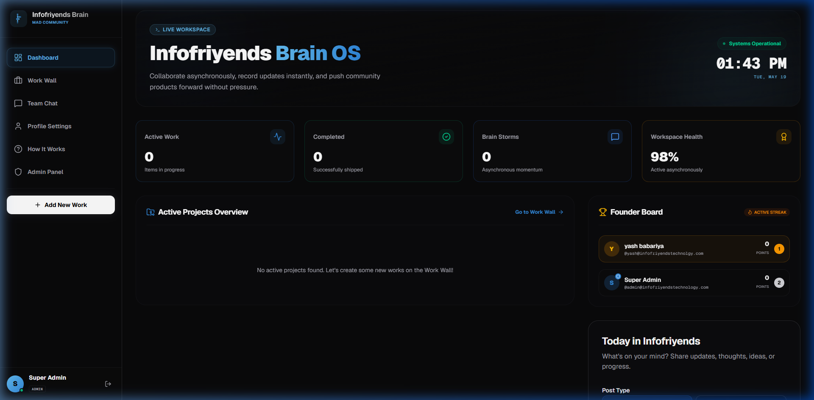
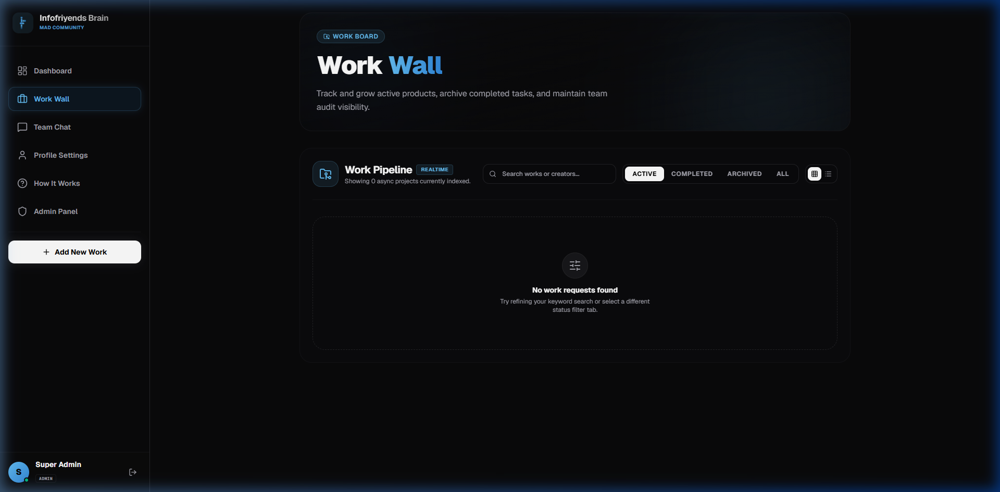
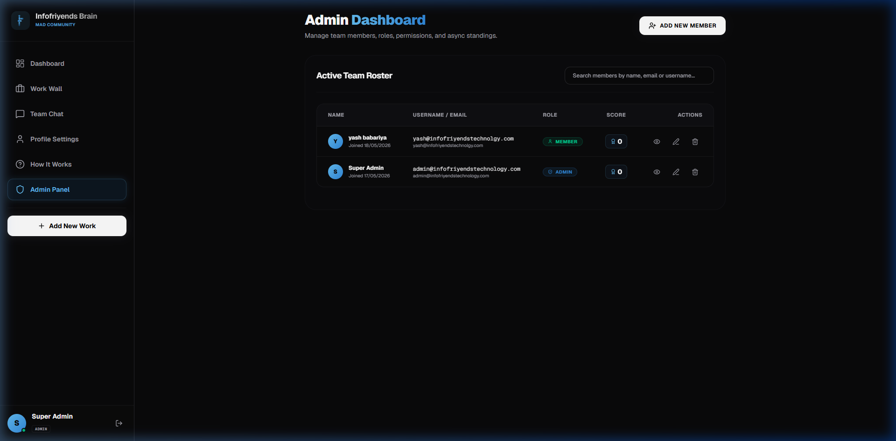

# Infofriyends Brain OS 🧠

Welcome to **Infofriyends Brain OS** — a high-fidelity, ultra-responsive asynchronous team operating system and collaboration suite. 

This platform is custom-built with premium dark glassmorphism, smooth animations, and gamified contribution leaderboards to power collaborative team workflows.

---

## 🚀 Key Modules & Features Built

### 1. 💬 Asynchronous Team Chat & Lounge (`/chat`)
* **Real-time Synchronization**: Unified read-only polling engine syncing channel communications, online statuses, and typing indicators every 3.5s with zero database write locks.
* **Typing Indicator**: Dynamic typing bubbles (`✍️ User is typing...`) debounced to optimize bandwidth.
* **Slide-out Sidebar Drawer**: On mobile viewports, the channel sidebar collapses into a sliding drawer toggleable via a header menu icon. Tap anywhere outside on the glassmorphic backdrop to auto-close the drawer.
* **Dedicated Loading Skeleton**: Pre-built mobile-responsive skeleton loading states that prevent page shifting during initial load.

### 2. 💼 Work Request & Approval Pipeline (`/works`)
* **Role-based Work Wall**: Standard members submit requests which default to a private `Pending` state. Admins review, approve, and activate tasks to publish them globally.
* **Points Automation**: Completing tasks awards **`+10 PTS`** to the creator instantly. Reverting a task back to active status automatically decrements the points to keep stats authentic.
* **Dual Layout Modes**: Toggleable Grid/Table views (table view locks on mobile to preserve visual layout).

### 3. 🛡️ Administrative Command Center (`/admin`)
* **Member Management**: Fully interactive interface to create new accounts, edit names, usernames, emails, roles (`ADMIN` or `MEMBER`), and manually override Contribution points.
* **Custom Overlays**: Replaced native browser confirmation alerts with beautiful custom Framer Motion modal windows to handle member deletion.

### 4. 🔑 Immersive Authentication Flow (`/login`)
* **Autofill Overrides**: Clean dark inputs with WebKit autofill overrides that keep input boxes dark and transparent.
* **Immersive Loader**: Animated scanner loading screen that visually transitions users into Brain OS upon successful authorization.
* **Custom Sign-out Dialogue**: Intercepts sign-out buttons with a premium logout confirmation dialog box.

### 5. 📢 Dashboard & Leaderboards (`/`)
* **Community Feed**: Post thought logs, idea broadcasts, and system progress updates.
* **Points Standing Leaderboard**: Active, real-time gamified dashboard tracking contribution standings.

---

## 📺 Application Walkthrough & Visuals

Here is a visual showcase of the core components in action:

### 1. 📢 Super Admin Dashboard & Community Feed (`/`)


### 2. 💬 Asynchronous Team Chat & Lounge (`/chat`)


### 3. 💼 Work Board & Request Pipeline (`/works`)


### 4. 🛡️ Administrative Command Center (`/admin`)


---

## 🛠️ Technology Stack & Dependencies Used

* **Next.js 15+ & React 19**: Server actions for unified backend logic, App Router, SSR, and dynamic component rendering.
* **Prisma ORM & SQLite**: SQLite local relational data store with type-safe DB client generation.
* **Zustand**: Lightweight global state management for coordinate controls (e.g. Navigation hiding, add-modal controls).
* **Framer Motion**: Smooth hardware-accelerated animations for overlays, sliding sidebars, and loader rings.
* **TailwindCSS v4 & Custom CSS**: Utility-first styling with custom variables (Cyan `#63BDF2` and Ocean Blue `#3188DA`).
* **Lucide React**: Clean vector iconography.

---

## 📱 Mobile Responsiveness Features

* **Compact Navigation Hub**: Mobile bottom navigation bar restricted to exactly 5 main items. Extra menu channels are dynamically grouped inside a clean sliding "More" submenu.
* **Hideable Navbar**: Includes a "Hide Navigation Bar" setting inside the submenu. When hidden, the bar slides down smoothly. A small, floating restore handle appears in the bottom-right corner to bring it back.
* **Zero Layout Overlaps**: Layout margins adjust dynamically depending on bottom navbar visibility state, preventing overlap with the chat input box.
* **Cards Layout Fallbacks**: The active members table and work wall toggle to a responsive grid of card elements on mobile devices.

---

## ⚙️ Quick Start & Setup

### 1. Prerequisites
Ensure you have Node.js (v18+) and npm installed.

### 2. Installation
Clone the repository and install packages:
```bash
npm install
```

### 3. Database Initialization
Generate client files and push your DB schema:
```bash
npx prisma generate
npx prisma db push
```

### 4. Running Locally
Launch the dev server:
```bash
npm run dev
```
Open [http://localhost:3000](http://localhost:3000) to see the dashboard.

### 5. Production Build
To build and check:
```bash
npm run build
```
