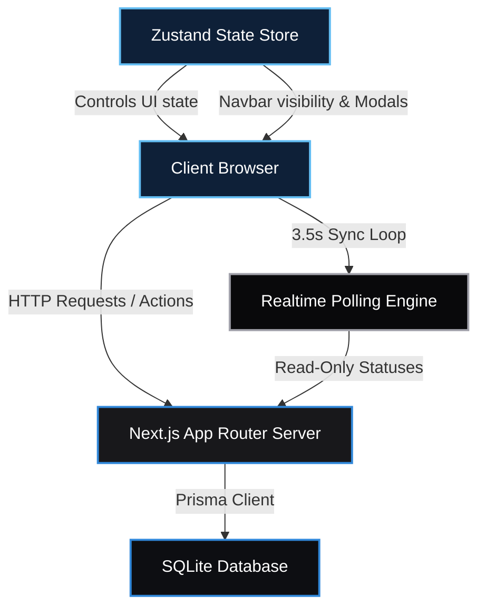
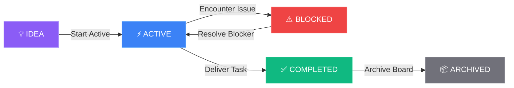
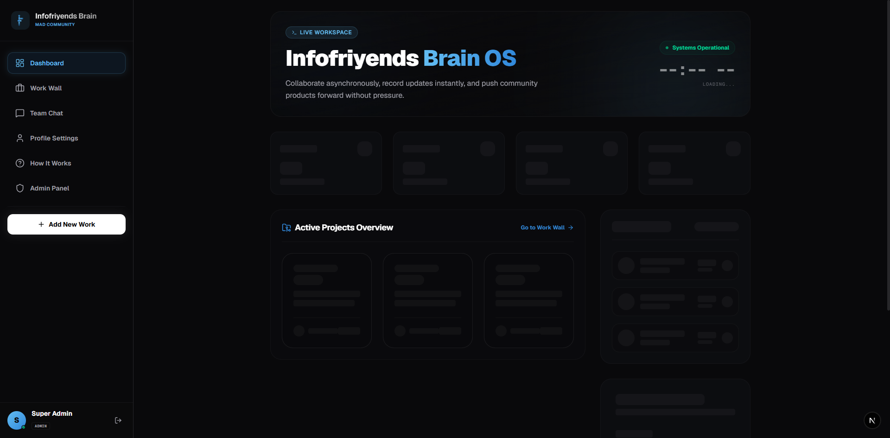
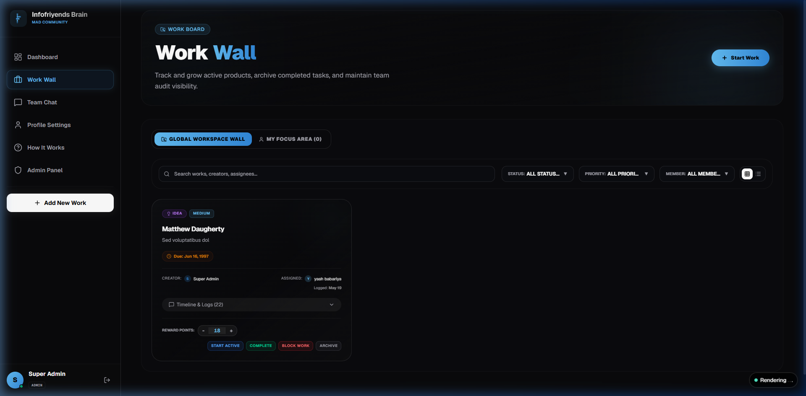
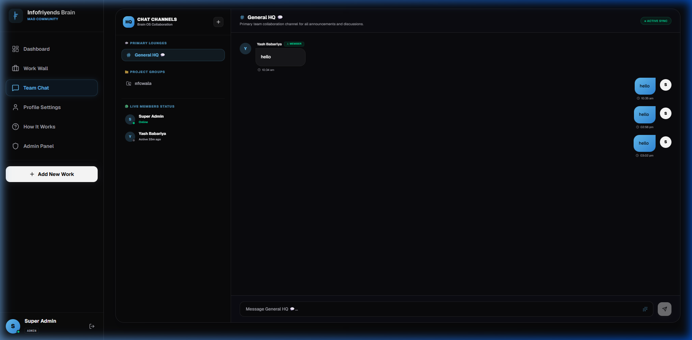
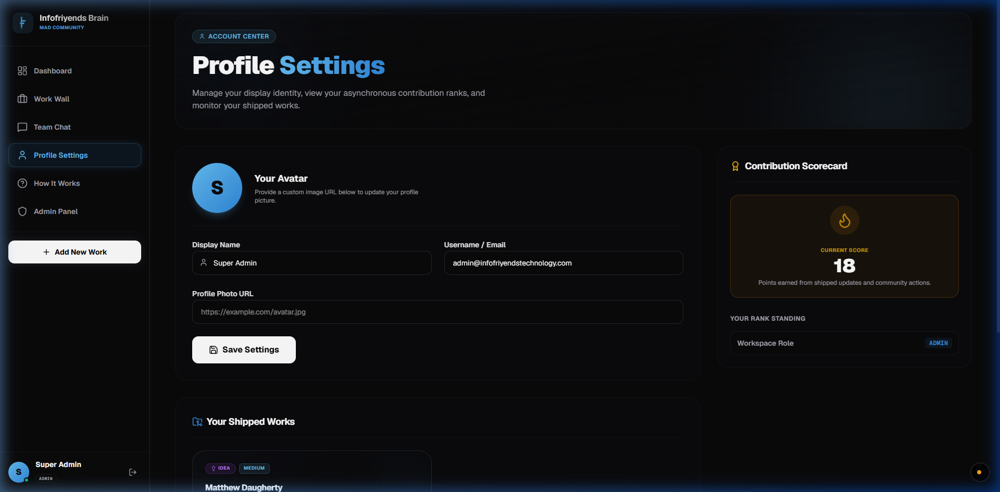
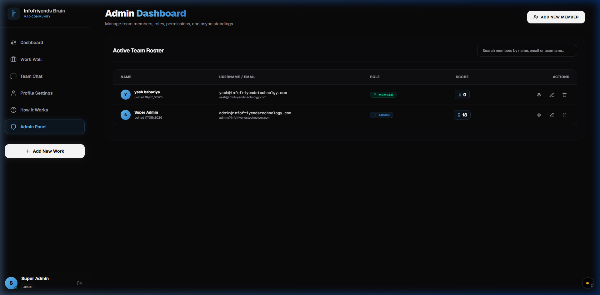
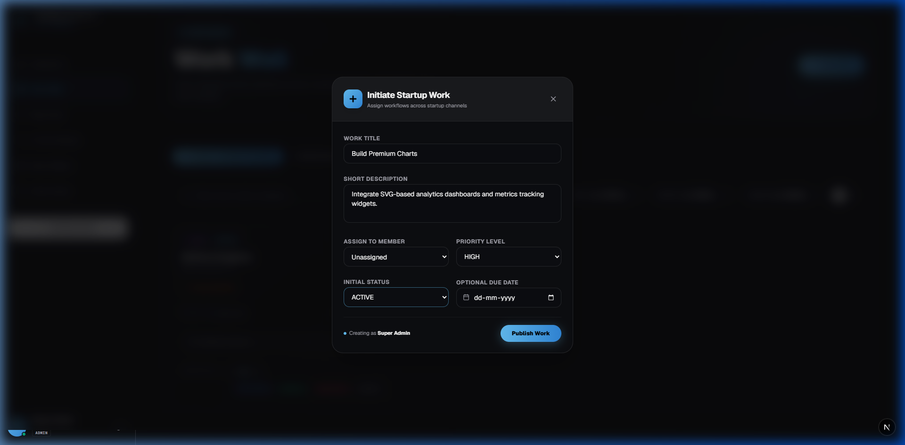
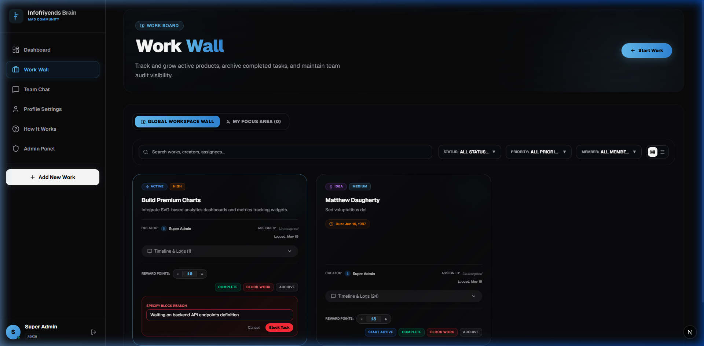

# Infofriyends Brain OS 🧠

Welcome to **Infofriyends Brain OS** — a high-fidelity, ultra-responsive asynchronous team operating system and collaborative startup workflow suite. 

This platform is custom-built with premium dark glassmorphism, hardware-accelerated animations, live-synchronized collaboration tools, and gamified contribution leaderboards to power modern team execution.

---

## 🗺️ System Architecture & Workflow Flowcharts

### 1. Unified Application Architecture
The diagram below illustrates the asynchronous state synchronization, server-side data layer, and component routing pipeline:



### 2. Work Assignment Status Lifecycle
Tracks active products, handles blocker alerts, and compiles activity logs for team visibility:



---

## 📺 Application Walkthrough & Visual Showcase

Here is a visual gallery of the main workspace centers captured directly from the running OS:

### 1. 📢 Super Admin Dashboard & Community Feed (`/`)
*Dynamic contribution standing leaderboards, broadcast logs, and startup-wide announcement board.*


### 2. 💼 Realtime Work Wall Pipeline & Filters (`/works`)
*Comprehensive async dashboard showing active startup assignments, custom dropdown filters, and status controls.*


### 3. 💬 Asynchronous Team Chat & Lounge (`/chat`)
*Live chat channels with typing notifications, mobile sliding drawer sidebar, and dynamic content streams.*


### 4. 🔑 Profile Settings & Shipped Works (`/profile`)
*Personal scorecards showing current rank status, active workspace credentials, and public work request history.*


### 5. 🛡️ Administrative Command Center (`/admin`)
*Full user controls: assign roles, add/edit team members, reset scores, and toggle dashboard permissions.*


### 6. 📝 Initiate Work Form Modal
*Premium dialog layout for launching assignments across channels with title, assignee, status, and priority inputs.*


### 7. 🛑 Block Work Dialogue Box
*Card-relative dialog for providing blocker context, updating the task status, and posting warning indicators.*


---

## 🛠️ Technology Stack & Engine Specs

| Technology | Layer | Purpose |
| :--- | :--- | :--- |
| **Next.js 15+** | Framework | App Router, Server Actions, Server-Side Rendering (SSR), and Streaming. |
| **React 19** | Library | High-performance client components, Suspense states, and reactive inputs. |
| **Prisma ORM** | Data Layer | Schema migrations, client generation, and type-safe relational model queries. |
| **SQLite** | Database | Fast local file-based database for project standalone environments. |
| **Zustand** | State Store | Global UI context management (e.g. navbar drawer state, modal visibility). |
| **Framer Motion** | Animation | Fluid, hardware-accelerated drawer slides, modal transitions, and load cycles. |
| **TailwindCSS v4** | Styling | Utility tokens configured with custom variables (Cyan `#63BDF2`, Blue `#3188DA`). |
| **Lucide React** | Icons | SVG vector illustration system for buttons, labels, and badges. |

---

## 🌟 Detailed Feature Architecture

### 1. Work Assignment Form & Modal
* **Create Work Sheet:** Accessed via header buttons or floating screen icons. Enables creation of work requests with custom configurations.
* **Fields Indexed:**
  * **Work Title:** Concise identifier of the startup assignment.
  * **Short Description:** Full details of deliverables, tasks, and requirements.
  * **Assign to Member:** Dynamic search menu of registered workspace members.
  * **Priority Level:** Classified into `LOW`, `MEDIUM`, `HIGH`, or `URGENT` tiers.
  * **Initial Status:** Selectable to boot immediately into a pipeline lifecycle state.
  * **Due Date:** Optional calendar picker specifying target delivery windows.

### 2. Work Status System & Badges
Tasks transition through designated lifecycle gates, each displaying responsive custom badge overlays:
* **`IDEA` (Purple):** Abstract tasks or proposed solutions waiting for planning greenlight.
* **`ACTIVE` (Blue):** Actively developed items assigned to a member.
* **`BLOCKED` (Red):** Stalled assignments requiring immediate coordination.
* **`COMPLETED` (Green):** Completed items showing total contribution rewards.
* **`ARCHIVED` (Zinc):** Historic deliverables stored for team compliance checks.

### 3. Personal Focus Area
* **My Focus tab:** Displays works assigned to the logged-in member.
* **Unresolved Creator Items:** Displays unresolved `IDEA`, `ACTIVE`, and `BLOCKED` cards created by the user, providing a single consolidated dashboard for daily focus.

### 4. Interactive Blocker Banners
* **Blocked Dialog:** Clicking "Block Work" triggers a reasons modal.
* **Warning Banners:** Once blocked, the reason is prominently rendered inside a red alert box at the top of the card. A system-wide admin notice is triggered when any item remains blocked.

### 5. Timeline Updates & Audit Log
* **Progress Streams:** Write custom logs or click suggestion chips ("UI completed", "Waiting for API", "Client replied") to post timeline notes.
* **Activity Logs:** All actions (creation, status modifications, points adjustments) are saved as permanent system logs rendered on card backfaces.

### 6. Mobile Responsiveness Optimization
* **5-Item Fixed Bar:** Screen navigation shrinks to five key icons on mobile viewports.
* **Dynamic Drawer Menu:** Additional channels slide up inside a "More" drawer context overlay.
* **Hideable Navbar Switch:** Allows hiding the navigation bar. Restoring it is made simple with a floating bottom corner toggle button.
* **Overlap Protection:** Margin properties automatically transition when the navbar is hidden or shown to prevent content overlaps with inputs.

---

## ⚙️ Quick Start & Setup

### 1. Installation
Clone the repository and install dependency nodes:
```bash
npm install
```

### 2. Database Initialization
Generate local Prisma client instances and apply DB schema structures:
```bash
npx prisma generate
npx prisma db push
```

### 3. Launch Development Server
```bash
npm run dev
```
Open [http://localhost:17526](http://localhost:17526) in your browser.

### 4. Production Build Verification
Verify production compiles clean of lint and types issues:
```bash
npm run build
```
