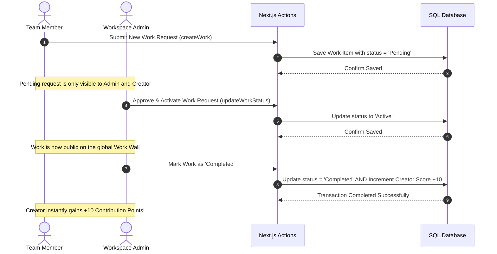

# Infofriyends Brain OS — Technical System Architecture Documentation

Welcome to the official technical documentation and system handbook of the **Infofriyends Brain OS**. This document outlines the modern technology stack, core architectural guidelines, role-based workflows, permissions, and built features of this application.

---

## 🛠️ Technology Stack & Core Infrastructure

The **Brain OS** is built on a high-performance, developer-first web stack optimized for lightning-fast responsiveness, strict type safety, and relational data integrity:

| Technology | Purpose | Description / Role |
| :--- | :--- | :--- |
| **Next.js 15+** | Web Framework | Utilizes Server-Side Rendering (SSR) for static rendering and lightning-fast loading speeds combined with Server Actions for unified backend logic. |
| **React 19** | Component Library | Powers the high-fidelity user interface, dynamic state rendering, and custom micro-animations. |
| **Prisma ORM** | Database Layer | Provides strict type safety for database access and migration controls. |
| **SQLite / PostgreSQL** | Database Engine | Handles relational storage of all workspace nodes (Users, Works, Posts). |
| **Framer Motion** | Animation Engine | Animates glassmorphic overlays, custom warning modals, dialogs, and navigation slides. |
| **TailwindCSS v4** | CSS Utility Suite | Handles responsive styling, curated color palettes, custom borders, and layout properties. |
| **Lucide React** | Visual Asset Icons | High-quality responsive modern vector iconography. |

---

## ⚡ Core Features Shipped

### 1. 🚪 Isolated Multi-State Authentication & Flow Control
* **Isolated Login Page**: The login page `/login` automatically strips away the Left Navigation Sidebar and the main container paddings (`lg:pl-72`), offering a completely isolated, immersive fullscreen experience.
* **Premium Theme Visuals**: Redesigned utilizing clean, modern styling based on custom color tokens: `#63BDF2` (Cyan/Light Blue) and `#3188DA` (Ocean Blue). Contains strictly zero purple highlights.
* **Auto-Fill Overrides**: Custom WebKit CSS rules intercept Chrome/Edge credential autofill backgrounds, ensuring input boxes remain dark, pristine, and perfectly transparent.
* **Confirm Sign-Out Overlay**: Intercepts legacied, clunky native browser pop-ups by rendering a beautiful React-based custom glassmorphic Logout Confirmation modal overlay.

### 2. 👑 Enterprise Administrative Control Center (`/admin`)
* **Dynamic Team Roster**: Instantly search/filter through workspace team members by their full name, email, or username.
* **Add New Member Modal**: Replaces basic static columns with a gorgeous, slide-in glassmorphic modal to register new members with custom emails, usernames, roles, and passwords.
* **Edit Member Dialog**: Admins can edit names, emails, usernames, workspace roles (`ADMIN` or `MEMBER`), and manually adjust Contribution Points.
* **Custom Delete Confirmation**: Features a gorgeous deletion alert overlay which cleans up related user posts and work items to preserve SQL database relational integrity safely.

### 3. 💼 Advanced Asynchronous Work Board (`/works` & `WorkWall`)
* **Role-Based Status Control**:
  * Standard **`MEMBER`** accounts submit works which default to the **`Pending Approval`** state.
  * Only **`ADMIN`** accounts can approve pending requests to make them `Active`, change status to `Completed`, or `Archived`.
* **Private Pending Requests**: Pending work requests are private and only visible to the Admin and the member who created them. Once approved by an Admin, they immediately become public on the global Work Wall.
* **Dynamic Contribution Points (+10 PTS)**: Whenever an Admin marks a work item as `Completed`, the system automatically increments the work creator's score by **`+10` points**! Changing it back safely reverts the allocated points.

### 4. 📢 Real-Time Community Feed (`TodayChanged`)
* **Asynchronous Updates**: Allows team members to broadcast `UPDATE`, `THOUGHT` (Cyan theme-compliant), `IDEA`, or `PROGRESS` messages instantly.
* **Leaderboards**: Displays current member point standings to keep members engaged and pushing products forward without pressure.

---

## ⚙️ How It Works (Internal Application Flow)

---

## 📂 File System Layout

* **`src/app/`**: Application routing, including layouts and server actions.
* **`src/components/`**: Reusable high-fidelity UI components.
  * [AdminDashboardClient.tsx](file:///C:/Users/SIS/OneDrive/Desktop/IMPORTANT/Infofriyends%20Brain/src/components/AdminDashboardClient.tsx): Administrative command center.
  * [AppLayout.tsx](file:///C:/Users/SIS/OneDrive/Desktop/IMPORTANT/Infofriyends%20Brain/src/components/AppLayout.tsx): Conditional layout controller.
  * [Sidebar.tsx](file:///C:/Users/SIS/OneDrive/Desktop/IMPORTANT/Infofriyends%20Brain/src/components/Sidebar.tsx): Global sidebar with confirmation modal.
  * [WorkWall.tsx](file:///C:/Users/SIS/OneDrive/Desktop/IMPORTANT/Infofriyends%20Brain/src/components/WorkWall.tsx): Dynamic work wall.
  * [WorkCard.tsx](file:///C:/Users/SIS/OneDrive/Desktop/IMPORTANT/Infofriyends%20Brain/src/components/WorkCard.tsx): Interactive work action handler.
* **`prisma/schema.prisma`**: Database schemas.

---

*Document Author: Infofriyends Technology Team.*
